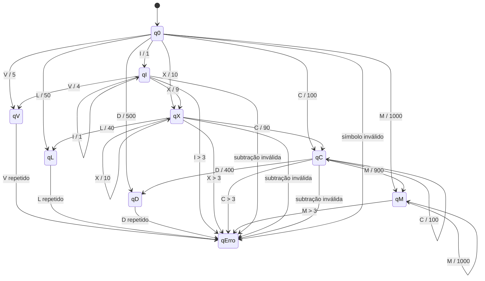

# EP 1 - LFA

## Escolha do Transdutor

Optamos pelo **Transdutor de Mealy** devido à natureza da gramática dos números romanos.

No sistema romano, o valor de um símbolo depende diretamente da relação com o símbolo seguinte. Por isso, a saída precisa ocorrer no momento da transição entre estados.

### Motivos da escolha

* **Eficiência de Estados:**
  No modelo de Mealy, a saída é gerada na própria transição. Isso permite tratar casos como `IV (4)` e `IX (9)` saindo de um único estado intermediário, sem necessidade de criar estados extras para cada resultado possível.

* **Contexto Imediato:**
  O transdutor reage imediatamente ao par **(estado atual + símbolo de entrada)**, o que é ideal para interpretar corretamente a lógica dos números romanos.

* **Menor Complexidade:**
  Se fosse utilizado um Transdutor de Moore, seria necessário criar estados adicionais para representar cada saída, aumentando consideravelmente o número de estados do autômato.

## Alfabetos

### Alfabeto de Entrada (Σ)

`{ I, V, X, L, C, D, M }`

### Alfabeto de Saída (Γ)

`{ 1, 4, 5, 9, 10, 40, 50, 90, 100, 400, 500, 900, 1000 }`

## Observação sobre as transições

Algumas transições não possuem alfabeto de saída explícito, pois apenas representam mudança de estado ou passagem para nova leitura.

Outras transições emitem saída numérica, correspondendo ao valor decimal do símbolo romano processado.

## Modelo do Transdutor



## Relação com o código Ruby

No código, cada transição é representada por:

```ruby
estado_anterior = estado
estado = "q#{simbolo}"

puts "#{estado_anterior} --#{simbolo}--> #{estado} | saida: #{valor}"
```

Esse trecho define:

* estado de origem
* símbolo de entrada
* estado de destino
* saída emitida

Exemplo:

```ruby
q0 --X--> qX | saida: 10
```
